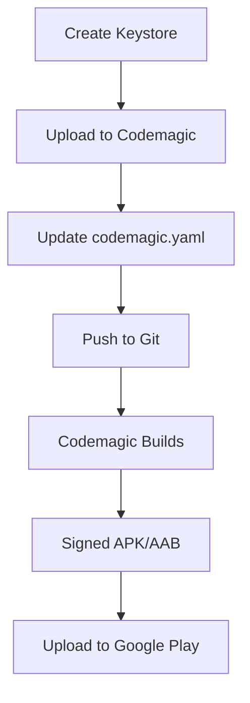

# Android Code Signing Setup Guide

This guide walks you through setting up Android code signing for the Africoin Wallet app to publish to Google Play Store.

## Overview

Android apps must be signed with a keystore to be published to Google Play Store. This guide covers:
1. Creating a keystore
2. Uploading to Codemagic
3. Configuring the build workflow
4. Building signed APK/AAB files

## Prerequisites

- Java Development Kit (JDK) installed
- Codemagic account with app configured
- Google Play Console account (for publishing)

---

## Step 1: Create Android Keystore

### Generate Keystore File

Run this command on your local machine:

```bash
keytool -genkey -v -keystore africoin-wallet.keystore \
  -alias africoin-wallet \
  -keyalg RSA \
  -keysize 2048 \
  -validity 10000
```

**You will be prompted for:**
- Keystore password (choose a strong password)
- Key password (can be same as keystore password)
- Your name
- Organization unit
- Organization name
- City/Locality
- State/Province
- Country code (2 letters, e.g., US)

**Example:**
```
Enter keystore password: [your-secure-password]
Re-enter new password: [your-secure-password]
What is your first and last name?
  [Unknown]:  Benjamin Mpolokoso
What is the name of your organizational unit?
  [Unknown]:  Development
What is the name of your organization?
  [Unknown]:  Africoin
What is the name of your City or Locality?
  [Unknown]:  Portland
What is the name of your State or Province?
  [Unknown]:  Oregon
What is the two-letter country code for this unit?
  [Unknown]:  US
Is CN=Benjamin Mpolokoso, OU=Development, O=Africoin, L=Portland, ST=Oregon, C=US correct?
  [no]:  yes

Enter key password for <africoin-wallet>
	(RETURN if same as keystore password):
```

### Verify Keystore

```bash
keytool -list -v -keystore africoin-wallet.keystore
```

### Important: Backup Your Keystore

⚠️ **CRITICAL:** Store your keystore and passwords securely!

- **Keystore file:** `africoin-wallet.keystore`
- **Keystore password:** [your password]
- **Key alias:** `africoin-wallet`
- **Key password:** [your password]

**Backup locations:**
1. Secure password manager (1Password, LastPass, etc.)
2. Encrypted cloud storage (Google Drive, Dropbox with encryption)
3. Physical secure location (safe, safety deposit box)

**⚠️ If you lose the keystore, you cannot update your app on Google Play!**

---

## Step 2: Upload Keystore to Codemagic

### Option A: Via Codemagic UI (Recommended)

1. Go to [Codemagic](https://codemagic.io/apps)
2. Select your app
3. Navigate to **Settings** → **Code signing identities**
4. Click **Android** tab
5. Click **Upload keystore**
6. Fill in the form:
   - **Keystore file:** Upload `africoin-wallet.keystore`
   - **Keystore password:** [your keystore password]
   - **Key alias:** `africoin-wallet`
   - **Key password:** [your key password]
   - **Reference name:** `africoin_wallet_keystore`

### Option B: Via Codemagic API

```bash
# Set your Codemagic API token
export CODEMAGIC_API_TOKEN="your_api_token"
export APP_ID="your_app_id"

# Upload keystore
curl -X POST \
  -H "x-auth-token: $CODEMAGIC_API_TOKEN" \
  -F "certificate=@africoin-wallet.keystore" \
  -F "certificate_password=your_keystore_password" \
  "https://api.codemagic.io/apps/$APP_ID/android-keystore"
```

---

## Step 3: Update Codemagic Configuration

The `codemagic.yaml` has been updated with Android signing configuration. Here's what was added:

```yaml
environment:
  android_signing:
    - africoin_wallet_keystore  # Reference to uploaded keystore
  groups:
    - africoin_env_vars
```

### Build Types

**Debug Build (unsigned):**
```bash
./gradlew assembleDebug
```

**Release Build (signed):**
```bash
./gradlew assembleRelease
# or for App Bundle
./gradlew bundleRelease
```

---

## Step 4: Build Signed APK/AAB

### Trigger Build

**Via Git Tag:**
```bash
git tag -a v1.0.0 -m "Release version 1.0.0"
git push origin v1.0.0
```

**Via Codemagic UI:**
1. Go to your app in Codemagic
2. Click **Start new build**
3. Select branch: `main`
4. Click **Start build**

### Build Outputs

After successful build, you'll get:
- **APK:** `android/app/build/outputs/apk/release/app-release.apk`
- **AAB:** `android/app/build/outputs/bundle/release/app-release.aab`

**For Google Play Store, use AAB (Android App Bundle).**

---

## Step 5: Verify Signed APK

### Check Signature

```bash
# Download the APK from Codemagic artifacts
# Then verify:
jarsigner -verify -verbose -certs app-release.apk
```

Expected output:
```
jar verified.
```

### View Certificate Info

```bash
keytool -printcert -jarfile app-release.apk
```

---

## Google Play Store Publishing

### First-Time Setup

1. **Create App in Google Play Console:**
   - Go to [Google Play Console](https://play.google.com/console)
   - Click **Create app**
   - Fill in app details
   - Set up store listing

2. **Upload AAB:**
   - Go to **Production** → **Create new release**
   - Upload `app-release.aab`
   - Fill in release notes
   - Review and rollout

### Automated Publishing (Optional)

Add Google Play publishing to `codemagic.yaml`:

```yaml
publishing:
  google_play:
    credentials: $GCLOUD_SERVICE_ACCOUNT_CREDENTIALS
    track: internal  # or alpha, beta, production
    submit_as_draft: true
```

**Setup:**
1. Create service account in Google Cloud Console
2. Download JSON key
3. Add to Codemagic as `GCLOUD_SERVICE_ACCOUNT_CREDENTIALS`
4. Grant access in Google Play Console

---

## Troubleshooting

### Build Fails: "Keystore not found"

**Solution:** Verify keystore reference name matches in `codemagic.yaml`:
```yaml
android_signing:
  - africoin_wallet_keystore  # Must match uploaded reference name
```

### Build Fails: "Invalid keystore format"

**Solution:** Ensure keystore is in JKS format:
```bash
keytool -importkeystore \
  -srckeystore africoin-wallet.keystore \
  -destkeystore africoin-wallet.keystore \
  -deststoretype jks
```

### Build Fails: "Wrong password"

**Solution:** Double-check passwords in Codemagic settings match your keystore.

### Google Play Rejects APK: "Signature mismatch"

**Solution:** You must use the same keystore for all updates. If you lost the original keystore, you'll need to create a new app listing.

---

## Security Best Practices

### Keystore Security

✅ **DO:**
- Store keystore in secure location
- Use strong passwords (16+ characters)
- Backup keystore in multiple secure locations
- Use Codemagic's secure storage for CI/CD
- Rotate passwords periodically

❌ **DON'T:**
- Commit keystore to Git repository
- Share keystore via email or chat
- Use weak passwords
- Store passwords in plain text
- Give keystore access to untrusted parties

### Password Management

Store these securely:
```
Keystore File: africoin-wallet.keystore
Keystore Password: [secure password]
Key Alias: africoin-wallet
Key Password: [secure password]
```

**Recommended tools:**
- 1Password
- LastPass
- Bitwarden
- KeePass

---

## Workflow Summary



---

## Quick Reference

### Generate Keystore
```bash
keytool -genkey -v -keystore africoin-wallet.keystore \
  -alias africoin-wallet -keyalg RSA -keysize 2048 -validity 10000
```

### Verify Keystore
```bash
keytool -list -v -keystore africoin-wallet.keystore
```

### Build Release APK
```bash
cd android
./gradlew assembleRelease
```

### Build Release AAB
```bash
cd android
./gradlew bundleRelease
```

### Verify Signed APK
```bash
jarsigner -verify -verbose -certs app-release.apk
```

---

## Resources

- [Android Developer: Sign Your App](https://developer.android.com/studio/publish/app-signing)
- [Codemagic: Android Code Signing](https://docs.codemagic.io/yaml-code-signing/signing-android/)
- [Google Play Console](https://play.google.com/console)
- [Capacitor: Android Configuration](https://capacitorjs.com/docs/android/configuration)

---

## Support

**Issues or Questions?**
- Codemagic Support: https://docs.codemagic.io/
- Google Play Support: https://support.google.com/googleplay/android-developer
- Project Issues: https://github.com/mpolobe/scroll-waitlist-exchange-1/issues

---

**Last Updated:** December 28, 2024  
**Status:** Ready for keystore setup and signed builds
