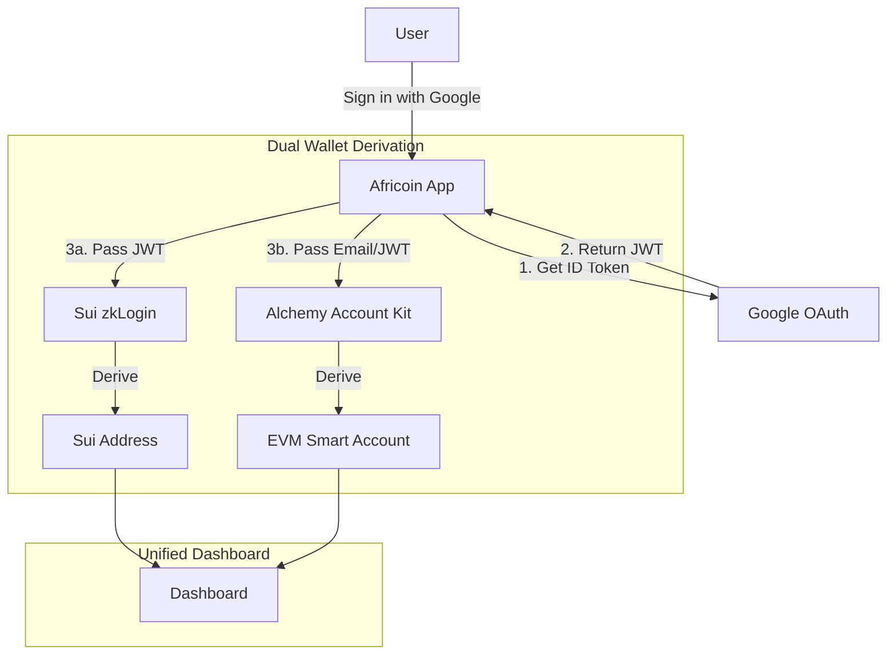

# Alchemy Account Kit + Sui zkLogin Harmonization Plan

## Executive Summary
This document outlines the strategy to harmonize the onboarding process for **Africoin Wallet** (EVM/Alchemy) and **Africa Railways** (Sui/zkLogin). The goal is to provide a unified "One Account" experience where a single social login (e.g., Google) authenticates the user for both blockchains simultaneously.

## 1. Architecture Overview

### Current State
- **EVM (Africoin):** Uses Alchemy Account Kit (Smart Wallet) with Email/Passkey auth.
- **Sui (Railways):** Uses zkLogin (Zero Knowledge Login) requiring an OIDC token (Google/JWT).
- **Auth Provider:** Supabase is used for app-level authentication.

### Harmonized Flow
We will implement a **"Bring Your Own Token" (BYOT)** strategy where the OIDC token from the initial login is distributed to both wallet providers.



## 2. Implementation Steps

### Phase 1: Dependency Management (Immediate)
The current repository is missing the required Sui SDKs. We must install:
- `@mysten/sui` (Core SDK)
- `@mysten/zklogin` (zkLogin utilities)
- `@mysten/bcs` (Byte conversion)

### Phase 2: Unified Auth Service (`src/lib/unifiedAuth.ts`)
Create a service that orchestrates the login:
1.  Trigger Google Login via Supabase or direct OAuth.
2.  Capture the `id_token` (JWT).
3.  **Sui Path:**
    -   Retrieve ephemeral keys from local storage.
    -   Call `completeZkLogin(id_token)` to generate the ZK proof.
    -   Derive the user's permanent Sui address.
4.  **EVM Path:**
    -   Authenticate Alchemy Account Kit using the user's email (or JWT if using Custom Auth).
    -   Initialize the Smart Account.

### Phase 3: Wallet Context Harmonization
Update `SmartWalletContext` to expose both wallets:
```typescript
interface UnifiedWalletContext {
  // EVM (Alchemy)
  evmAddress: string;
  evmBalance: string;
  sendTransaction: (tx: any) => Promise<string>;
  
  // Sui (zkLogin)
  suiAddress: string;
  suiBalance: string;
  executeSuiTransaction: (tx: any) => Promise<string>;
  
  // Shared
  user: User;
  isConnected: boolean;
}
```

## 3. Technical Challenges & Solutions

### Challenge: Ephemeral Keys
**Issue:** zkLogin requires an ephemeral key pair generated *before* the user logs in.
**Solution:**
-   On the "Sign In" page load, silently generate a Sui ephemeral key pair.
-   Store it in `localStorage`.
-   Pass the `nonce` (derived from the ephemeral public key) to the Google Login request.

### Challenge: Proving Service
**Issue:** Generating the ZK proof is computationally heavy and usually requires a remote Proving Service.
**Solution:**
-   For **Dev/Testnet:** Use Mysten Labs' public devnet prover (`https://prover-dev.mystenlabs.com/v1`).
-   For **Mainnet:** We must deploy our own proving service or use a partner provider.

## 4. Next Steps for Developer
1.  Run `npm install @mysten/sui @mysten/zklogin` (Added to package.json).
2.  Update `src/pages/Signup.tsx` to initialize the zkLogin nonce before redirecting to Google.
3.  Verify the `AuthCallback.tsx` logic handles the ZK proof generation failures gracefully (as the prover might be rate-limited).
